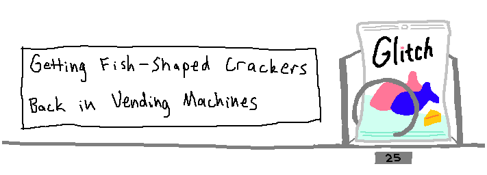

[Getting Fish-Shaped Crackers Back in Vending Machines](https://marketplace.visualstudio.com/items?itemName=wh0.fishcracker) is a [Visual Studio Code](https://code.visualstudio.com/) extension to connect to [Glitch](https://glitch.com).

## Commands

1. `auth`: Sign in to Glitch with a sign-in code, as a new anonymous user, or with your persistent token
1. `logout`: Sign out of Glitch
1. `open_project`: Open a project by name. Must be signed in
1. `logs`: Open the Glitch logs
1. `term_command`: Open the Glitch terminal
1. `close`: Close a Glitch connection

## Getting your Glitch persistent token

1. Open [Glitch](https://glitch.com/) and log in to your account
2. Open Devtools by pressing `F12` or `Ctrl`+`Shift`+`I`
3. In the console, run this command:
   ```js
   copy(JSON.parse(localStorage.cachedUser).persistentToken)
   ```
4. Paste that in the persistent token input to sign in.

**WARNING: This persistent token is like a password. *Don't share it with anyone.***
